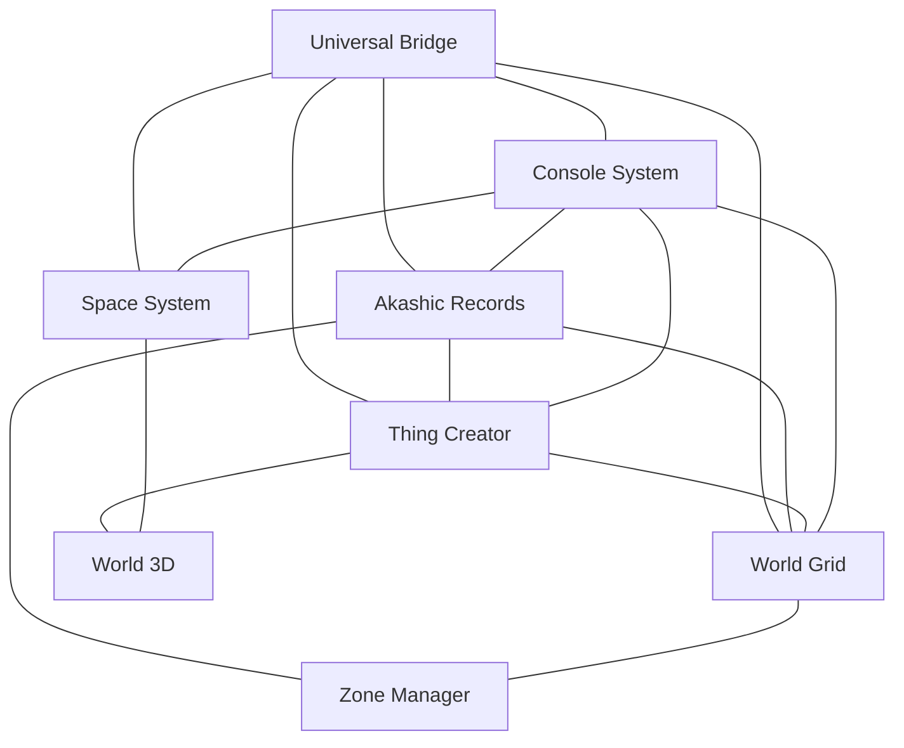
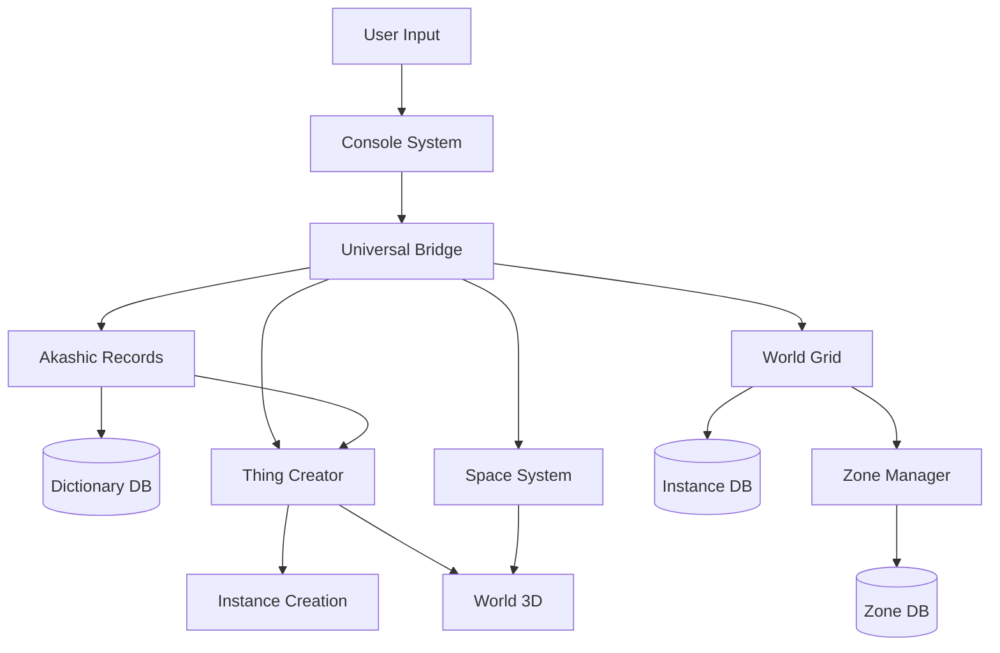
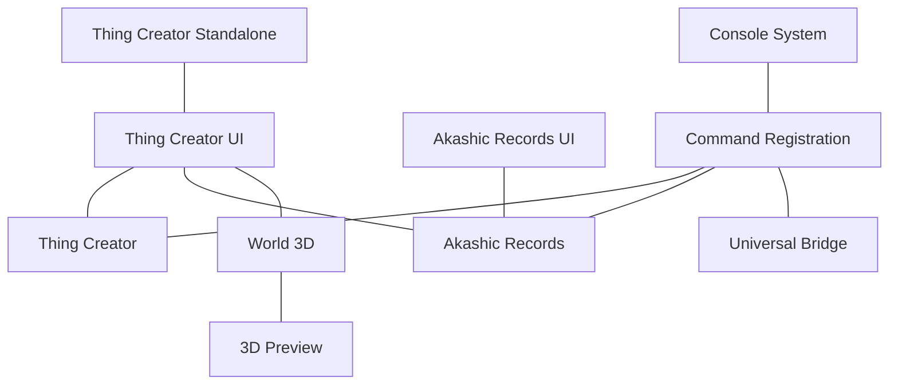
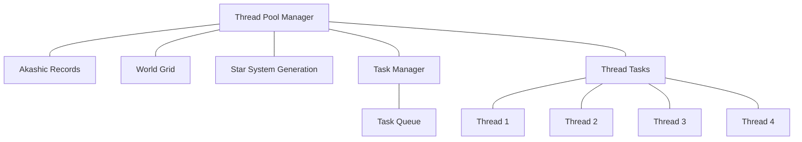
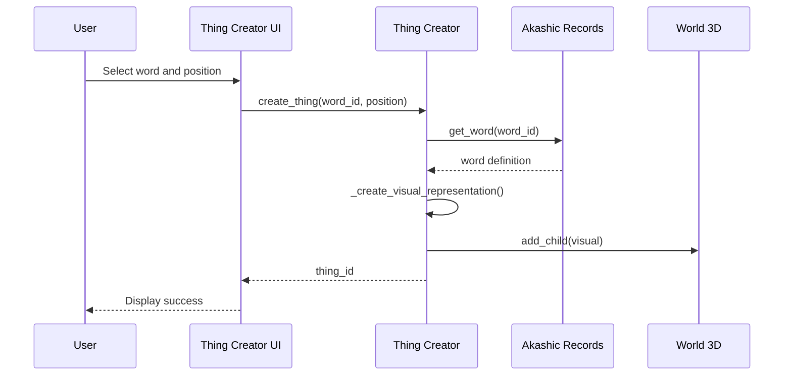

# Eden Project - System Connections

This document visualizes the connections between the various systems in the Eden project.

## Core System Connections

## Data Flow Diagram

## Subsystem Details

### Universal Bridge Connections

The Universal Bridge serves as the central hub connecting all major systems. It:

1. **Discovers and Initializes Systems**
   - Finds or creates Akashic Records Manager
   - Finds or creates Thing Creator
   - Connects to Space System and World Grid when available

2. **Provides Unified API**
   - `create_thing_from_word(word_id, position)` - Creates a thing using Thing Creator
   - `process_thing_interaction(thing1_id, thing2_id)` - Manages interactions
   - `transform_thing(thing_id, new_type)` - Transforms an existing thing
   - `register_element(element, type_name)` - Registers elements with Akashic Records

3. **Manages Signals**
   - `entity_registered(entity_id, word_id, element_id)` - When entity is registered
   - `entity_transformed(entity_id, old_type, new_type)` - When entity changes type
   - `interaction_processed(entity1_id, entity2_id, result)` - When interaction completes

### Akashic Records Connections

The Akashic Records system manages the dictionary of all words and their properties:

1. **Interfaces With**:
   - Universal Bridge: For global access
   - Thing Creator: Provides word definitions
   - Zone Manager: For location-based word evolution
   - Dynamic Dictionary: For storing word definitions

2. **Provides**:
   - `create_word(id, category, properties)` - Creates new word definitions
   - `get_word(word_id)` - Retrieves word definitions
   - `process_word_interaction(word1_id, word2_id)` - Processes interactions between words
   - `search_words(query, category)` - Searches for words matching criteria

3. **Receives**:
   - Word creation requests
   - Interaction results for evolution
   - Zone information for context-aware adaptations

### Thing Creator Connections

The Thing Creator instantiates entities in the 3D world based on dictionary definitions:

1. **Interfaces With**:
   - Universal Bridge: For global access
   - Akashic Records: Gets word definitions
   - World 3D: Creates visual representations
   - World Grid: For spatial positioning

2. **Provides**:
   - `create_thing(word_id, position, properties)` - Creates things from words
   - `remove_thing(thing_id)` - Removes things from the world
   - `get_thing(thing_id)` - Gets information about a thing
   - `update_thing_position(thing_id, position)` - Updates thing position

3. **Receives**:
   - Thing creation requests
   - Interaction triggers
   - Position updates

### Console System Connections

The Console System provides a command-line interface for interacting with the game:

1. **Interfaces With**:
   - Universal Bridge: For accessing all systems
   - Akashic Records: For word management
   - Thing Creator: For entity management
   - Various subsystems: For specialized commands

2. **Provides**:
   - Command registration and execution
   - Text output
   - Command history
   - Input parsing

3. **Receives**:
   - User input
   - System status notifications
   - Error messages

## UI Connections

## Thread Management

## Data Flow for Entity Creation

## Integration Points for New Systems

When adding new systems to the Eden project, connect them through these integration points:

1. **Universal Bridge Integration**:
   - Register the system with the Universal Bridge
   - Connect to relevant signals
   - Provide a standardized API

2. **Console Integration**:
   - Register commands using ConsoleIntegrationHelper
   - Implement command handlers
   - Connect to console signals

3. **UI Integration**:
   - Create a UI component for the system
   - Connect UI to system through Universal Bridge
   - Standardize UI appearance and behavior

4. **Threading Integration**:
   - Use Thread Pool Manager for concurrent operations
   - Register tasks with Task Manager
   - Handle thread synchronization properly